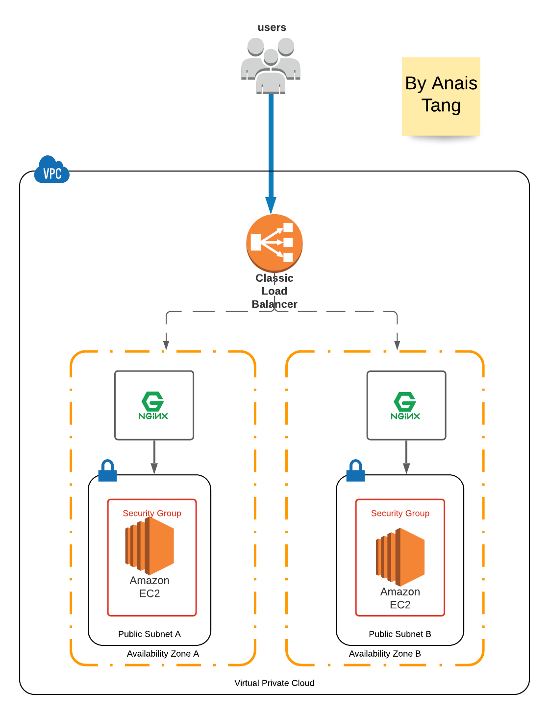
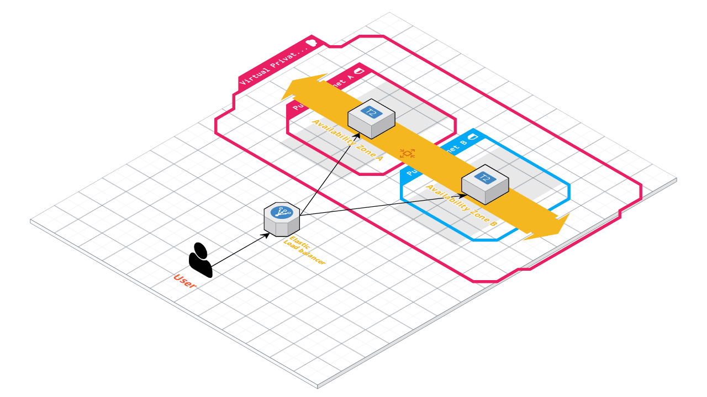

# Graduate Cloud Engineer Task


## Tasks
- Terraform a cloud environment 

## Subtasks
-[x]Terraform a load balanced front end application in AWS
-[x]The VPC should contain at least 2 instances 
-[x]The instances should be able to scale across different availability zones
-[x]The VPC should be split into the relevant subnets 
-[x]The hosts should be running on Linux servers 
-[x]The instances should be running on a web server 
-[]The Terraform code should be modularised


## Design Phase
- Create EC2 Instance 
- Create Load Balancer VPC
- Configure load balancer across all availability zones for necessary instances 
- Auto-scale with Load Balancer

---

---

---


## File Structure 

 ```bash
➜  Digital_AND_Anais git:(master) ✗ tree
.
├── README.md
├── images
│   ├── loadbalancedvisualAT.png
│   └── loadbalancedwithNginxAtang.png
└── modules
    └── app
        ├── main.tf
        ├── terraform.tfstate
        ├── terraform.tfstate.backup
        └── variables.tf

3 directories, 7 files
 ```

## Commands 
```bash
$ terraform init
$ terraform plan 
$ terraform apply
```

## Applying changes 
```bash
➜  app git:(master) ✗ terraform apply
var.key_name
  Enter a value: test_tang

tls_private_key.default: Refreshing state... [id=2d5fac2e8eb896699bb20ada5ae7020e6f5c0965]
aws_vpc.default: Refreshing state... [id=vpc-09ce085e1be36f38a]
aws_internet_gateway.default: Refreshing state... [id=igw-0f44dcedac9df3a4d]
aws_route_table.private[0]: Refreshing state... [id=rtb-0badfae6015549824]
aws_subnet.public_subnet: Refreshing state... [id=subnet-093af4e4b0f33fb25]
aws_route_table.private[1]: Refreshing state... [id=rtb-00474ba2f737eb1fd]
aws_security_group.elb_default: Refreshing state... [id=sg-0257b24e3b00fe995]
aws_route_table.public[1]: Refreshing state... [id=rtb-02e02805bf1b37b8f]
aws_security_group.default: Refreshing state... [id=sg-00812caac01d2a2fa]
aws_route_table.public[0]: Refreshing state... [id=rtb-07e49f6663cf8b278]
aws_route.internet_access: Refreshing state... [id=r-rtb-0c169db52376932f11080289494]
aws_elb.default: Refreshing state... [id=default-elb]

An execution plan has been generated and is shown below.
Resource actions are indicated with the following symbols:
  + create
-/+ destroy and then create replacement

Terraform will perform the following actions:

  # aws_elb_attachment.default[0] will be created
  + resource "aws_elb_attachment" "default" {
      + elb      = "default-elb"
      + id       = (known after apply)
      + instance = (known after apply)
    }

  # aws_elb_attachment.default[1] will be created
  + resource "aws_elb_attachment" "default" {
      + elb      = "default-elb"
      + id       = (known after apply)
      + instance = (known after apply)
    }

  # aws_instance.web_app1 will be created
  + resource "aws_instance" "web_app1" {
      + ami                          = "ami-0823c236601fef765"
      + arn                          = (known after apply)
      + associate_public_ip_address  = true
      + availability_zone            = (known after apply)
      + cpu_core_count               = (known after apply)
      + cpu_threads_per_core         = (known after apply)
      + get_password_data            = false
      + host_id                      = (known after apply)
      + id                           = (known after apply)
      + instance_state               = (known after apply)
      + instance_type                = "t2.micro"
      + ipv6_address_count           = (known after apply)
      + ipv6_addresses               = (known after apply)
      + key_name                     = "test_tang"
      + outpost_arn                  = (known after apply)
      + password_data                = (known after apply)
      + placement_group              = (known after apply)
      + primary_network_interface_id = (known after apply)
      + private_dns                  = (known after apply)
      + private_ip                   = (known after apply)
      + public_dns                   = (known after apply)
      + public_ip                    = (known after apply)
      + secondary_private_ips        = (known after apply)
      + security_groups              = (known after apply)
      + source_dest_check            = true
      + subnet_id                    = "subnet-093af4e4b0f33fb25"
      + tags                         = {
          + "Name" = "webapp1.AndDigital.Tang"
        }
      + tenancy                      = (known after apply)
      + volume_tags                  = (known after apply)
      + vpc_security_group_ids       = (known after apply)

      + ebs_block_device {
          + delete_on_termination = (known after apply)
          + device_name           = (known after apply)
          + encrypted             = (known after apply)
          + iops                  = (known after apply)
          + kms_key_id            = (known after apply)
          + snapshot_id           = (known after apply)
          + volume_id             = (known after apply)
          + volume_size           = (known after apply)
          + volume_type           = (known after apply)
        }

      + ephemeral_block_device {
          + device_name  = (known after apply)
          + no_device    = (known after apply)
          + virtual_name = (known after apply)
        }

      + metadata_options {
          + http_endpoint               = (known after apply)
          + http_put_response_hop_limit = (known after apply)
          + http_tokens                 = (known after apply)
        }

      + network_interface {
          + delete_on_termination = (known after apply)
          + device_index          = (known after apply)
          + network_interface_id  = (known after apply)
        }

      + root_block_device {
          + delete_on_termination = (known after apply)
          + device_name           = (known after apply)
          + encrypted             = (known after apply)
          + iops                  = (known after apply)
          + kms_key_id            = (known after apply)
          + volume_id             = (known after apply)
          + volume_size           = (known after apply)
          + volume_type           = (known after apply)
        }
    }

  # aws_instance.web_app2 will be created
  + resource "aws_instance" "web_app2" {
      + ami                          = "ami-0823c236601fef765"
      + arn                          = (known after apply)
      + associate_public_ip_address  = true
      + availability_zone            = (known after apply)
      + cpu_core_count               = (known after apply)
      + cpu_threads_per_core         = (known after apply)
      + get_password_data            = false
      + host_id                      = (known after apply)
      + id                           = (known after apply)
      + instance_state               = (known after apply)
      + instance_type                = "t2.micro"
      + ipv6_address_count           = (known after apply)
      + ipv6_addresses               = (known after apply)
      + key_name                     = "test_tang"
      + outpost_arn                  = (known after apply)
      + password_data                = (known after apply)
      + placement_group              = (known after apply)
      + primary_network_interface_id = (known after apply)
      + private_dns                  = (known after apply)
      + private_ip                   = (known after apply)
      + public_dns                   = (known after apply)
      + public_ip                    = (known after apply)
      + secondary_private_ips        = (known after apply)
      + security_groups              = (known after apply)
      + source_dest_check            = true
      + subnet_id                    = "subnet-093af4e4b0f33fb25"
      + tenancy                      = (known after apply)
      + volume_tags                  = (known after apply)
      + vpc_security_group_ids       = (known after apply)

      + ebs_block_device {
          + delete_on_termination = (known after apply)
          + device_name           = (known after apply)
          + encrypted             = (known after apply)
          + iops                  = (known after apply)
          + kms_key_id            = (known after apply)
          + snapshot_id           = (known after apply)
          + volume_id             = (known after apply)
          + volume_size           = (known after apply)
          + volume_type           = (known after apply)
        }

      + ephemeral_block_device {
          + device_name  = (known after apply)
          + no_device    = (known after apply)
          + virtual_name = (known after apply)
        }

      + metadata_options {
          + http_endpoint               = (known after apply)
          + http_put_response_hop_limit = (known after apply)
          + http_tokens                 = (known after apply)
        }

      + network_interface {
          + delete_on_termination = (known after apply)
          + device_index          = (known after apply)
          + network_interface_id  = (known after apply)
        }

      + root_block_device {
          + delete_on_termination = (known after apply)
          + device_name           = (known after apply)
          + encrypted             = (known after apply)
          + iops                  = (known after apply)
          + kms_key_id            = (known after apply)
          + volume_id             = (known after apply)
          + volume_size           = (known after apply)
          + volume_type           = (known after apply)
        }
    }

  # aws_key_pair.auth will be created
  + resource "aws_key_pair" "auth" {
      + arn         = (known after apply)
      + fingerprint = (known after apply)
      + id          = (known after apply)
      + key_name    = "test_tang"
      + key_pair_id = (known after apply)
      + public_key  = "ssh-rsa AAAAB3NzaC1yc2EAAAADAQABAAACAQDAMb8Nxx9f8Zxh0s2W2XBkSPGqpVKu5LUSadSe8pFaUhw1MORHYAYNfNNVghyOqoh223OiNvvR1AivJ1UDBfwN6XO0wsU+zqj+AfRwX0XF1gmZKg3LrKZ/qm8kqgmuHAyjEJJRYj6PRh0LRIdpoZvrPcGrG5yOKAwQsF2Nu5dIY/M6w19umoNsqaVUX59wu4K3Eg6mVvMplzxx6z2X0aCs0BItNoYSNZBE8OV1DZRnmxAw83d4jsDJqPaHx1vOiQOQVS7xXWhe83PhQu/SkFAxchRyOMnYNUBIOSBpAlH4NRF3oJA0fUSKDP+CPCJ3w2GHDsK2rFtWGp0hljH2hQVdtYWoCSeUw6+59HaHY5yOh/uGSazrOb5x/OS6iVYtUR13N+/r2exYx9Gp3mVCHW9QXlALHPHMJC/DGODquB02D61x4x+qFRuI9lpBwiiY9eAZbjN70i/aDPMFKPH/kkf8gHeH1YFuyHoTBjG8vZ875sA1XtMmx2j5nhE6cFKLGzCNCVzKpaG3lT+IF9r0wPSudAdWWRUKnTpLpiCbCz1pDCiycOdk0KaJVnwmsvYFxLoZcSaEdFg+MyiBITo47OHpr1Bs2gpINKWtNrcYRLlbskPLu7GEVs3rHXCi0NsHp5y2EhWsiqOvB++Bx5Zkq9UqtuSNvtjRYBNxyuErJ7+WXQ=="
    }

```


## Further iterations
- Autoscaling Group
- Cloud Watch
- Modularise the code
- EC2, ELB components in separate folders 
